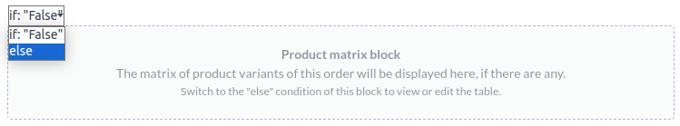

===========
PDF reports
===========

With Studio, you can :ref:`edit existing PDF reports <studio/pdf-reports/edit>` (e.g., invoices,
quotations, etc.) or :ref:`create new ones <studio/pdf-reports/edit>`.

.. _studio/pdf-reports/default-layout:

Default layout
==============

The default layout of reports is managed outside Studio. Go to :menuselection:`Settings`, then, in
the :guilabel:`Companies` section, click :guilabel:`Configure Document Layout`. Layout settings are
company-specific but apply to all reports.

.. tip::
   Click :guilabel:`Download PDF Preview` to download a sample invoice PDF and see how the different
   settings affect the report layout.

.. _studio/pdf-reports/default-layout/layout:

The following settings are available:

- :guilabel:`Layout`: Four layouts are available:

  .. tabs::

     .. tab:: Light

        .. image:: pdf_reports/light.png
           :alt: Light report layout sample

     .. tab:: Boxed

        .. image:: pdf_reports/boxed.png
           :alt: Boxed report layout sample

     .. tab:: Bold

        .. image:: pdf_reports/bold.png
           :alt: Bold report layout sample

     .. tab:: Striped

        .. image:: pdf_reports/striped.png
           :alt: Striped report layout sample

.. _studio/pdf-reports/default-layout/font:

- :guilabel:`Font`: Seven fonts are available: Lato, Roboto, Open Sans, Montserrat, Oswald, Raleway,
  Tajawal (which supports both Arabic and Latin scripts). Go to `Google Fonts <https://fonts.google.com/>`_
  to preview them.

.. _studio/pdf-reports/default-layout/logo:

- :guilabel:`Company logo`: Click the :guilabel:`Edit` button to upload or change the logo. This
  adds the logo to the company’s record on the *Company* model, which you can access by going to
  :menuselection:`Settings`, then clicking :guilabel:`Update Info` in the :guilabel:`Companies`
  section.

.. _studio/pdf-reports/default-layout/colors:

- :guilabel:`Colors`: Change the primary and secondary colors used throughout reports to highlight
  important elements. The default colors are automatically generated based on the colors of the logo.

.. _studio/pdf-reports/default-layout/background:

- :guilabel:`Layout background`: The following backgrounds are available:

  - :guilabel:`Blank`: nothing is displayed.
  - :guilabel:`Geometric`: an image featuring geometric shapes is displayed in the background.
  - :guilabel:`Custom`: use a custom background image by uploading one.

.. _studio/pdf-reports/default-layout/tagline:

- :guilabel:`Company tagline`: This is displayed in the header of :ref:`External reports
  <studio/pdf-reports/header-footer/external>`. You can add multiple lines of text.

.. _studio/pdf-reports/default-layout/details:

- :guilabel:`Company details`: These are displayed in the header of :ref:`External reports
  <studio/pdf-reports/header-footer/external>`. You can add multiple lines of text.

.. _studio/pdf-reports/default-layout/footer:

- :guilabel:`Footer`: This text is used in the :ref:`External reports'
  <studio/pdf-reports/header-footer/external>` footers. You can add multiple lines of text. You can
  also edit the footer using the :ref:`report editor <studio/pdf-reports/edit>`.

.. _studio/pdf-reports/default-layout/paper:

- :guilabel:`Paper format`: to define the default paper size of reports. You can either select
  :guilabel:`A4` (21 cm x 29.7 cm), :guilabel:`US Letter` (21.59 cm x 27.54 cm), or
  :guilabel:`QR codes page`. This can also be defined for individual reports in the
  :guilabel:`Paper format` field in :ref:`Studio <studio/pdf-reports/create>`.

.. _studio/pdf-reports/edit:

Editing PDF reports
===================

To access the reports available for a model, access the model (e.g. sales orders), click the
**Toggle Studio** button, then click :guilabel:`Reports`. Select an existing report to open it, or
:ref:`create a new one <studio/pdf-reports/create>`.

.. important::
   To edit a standard PDF report, it is strongly recommended to **duplicate** it and make changes to
   the duplicated version, as changes made to standard reports are overwritten after an Odoo
   upgrade. To duplicate a report, hover the mouse pointer on the top right corner of the report,
   click the vertical ellipsis icon (:guilabel:`⋮`), and then select :guilabel:`Duplicate`.

   .. image:: pdf_reports/duplicate-report.png
      :alt: Duplicating a PDF report

.. tip::
   Alternatively, you can also open Studio, then click :guilabel:`Reports` and remove the contents
   of the search field to display all reports, or search for a specific model (e.g. `sale.order`,
   `mrp.production`, etc.) or report.

Options
-------

The options in the left part of the screen allow you to:

- change the :guilabel:`Report name`. The new name is applied everywhere (in Studio, under
  the :guilabel:`Print` button, and in the PDF file name).
- modify the :guilabel:`Report format`. If no value is selected, the default format defined in the
  :ref:`default layout <studio/pdf-reports/default-layout/paper>` is used.
- :guilabel:`Add in print`: to add the report in the :guilabel:`Print` menu available from the
  record.
- :guilabel:`Limit visibility to groups`: to limit the availability of the PDF report to specific
  :doc:`user groups <../../general/users/access_rights>`.
- :guilabel:`Edit sources`: to modify the report directly in the :ref:`XML file
  <studio/pdf-reports/XML-editing>`;
- :guilabel:`Reset report`: to discard all changes made on the report and reset it to its standard
  state;
- generate and download a :guilabel:`Report preview`.

Report editor
-------------

The report editor allows you to modify the formatting and contents of the report.

The dashed rectangles represent conditional blocks (if/else statements).  Click on the block to view
the conditions and select a value to preview its corresponding output and edit it if necessary.

The blue text represents default values which are replaced by field values when the report is
generated.

Using the report editor, you can:

- select the text and format it using the :ref:`knowledge/text-editor`;

  .. image:: pdf_reports/text-editor.png
     :alt: Format text using the text editor

- modify static text (directly in the report editor);
- remove or :ref:`add content <studio/pdf-reports/add-content>`.

.. important::
   Editing the header and footer of a report impacts all standard and custom reports.

.. tip::
   - You can :guilabel:`Undo` or :guilabel:`Redo` changes using the related buttons or the shortcuts
     `CTRL Z` and `CTRL Y`.
   - Changes are saved automatically when you leave the report, or manually using the
     :guilabel:`Save` button.

.. _studio/pdf-reports/add-content:

Adding content
~~~~~~~~~~~~~~

You can add contents to the report using the :ref:`knowledge/powerbox`. Type `/` to open the
**powerbox**, then type the command's name or select it from the list.

The `Field` command
*******************

To add a field into the report, type `/`, and select the `Field` command. In the list that opens,
select or search for the field; click the right arrow next to the field name to access the list of
related fields if needed.

Then, specify the default value and press `Enter`.

Other commands here?
********************

.. _studio/pdf-reports/XML-editing:

XML editing: examples
~~~~~~~~~~~~~~~~~~~~~

.. warning::
   Modifying the XML directly may result in report issues during upgrades. If this happens, simply
   copy your changes from the duplicate database created as part of the upgrade process into your
   upgraded database.

To edit the report's XML, click :guilabel:`Edit sources` in the left pane.

XXX change

- Can select view
- Can search for or select another record or go to the next/previous record to preview
- Can close editor using button

Add a new column in a SO line table
***********************************

Adapt the image size
********************

Modify or add conditions
************************

Add a table
***********

.. _studio/pdf-reports/create:

Creating new PDF reports
========================

To create a new report for a model, access the model, click the **Toggle Studio** button, then click
:guilabel:`Reports`. Click :guilabel:`New` and, in the popup window that opens, select the type of
report: :ref:`studio/pdf-reports/header-footer/external`, :ref:`studio/pdf-reports/header-footer/internal`,
or :ref:`studio/pdf-reports/header-footer/blank`. This is solely used to determine what is displayed
in the header and footer.

.. _studio/pdf-reports/header-footer/external:

External
--------

The header displays the :ref:`logo <studio/pdf-reports/default-layout/logo>` and several values set on the
*Company* model: the :guilabel:`Company Name`, :guilabel:`Phone`, :guilabel:`Email`, and
:guilabel:`Website`.

.. tip::
   To change a company's information, go to :menuselection:`Settings`, then, in the
   :guilabel:`Companies` section, click :guilabel:`Update Info`.

.. image:: pdf_reports/external-header.png
   :alt: Example of an External header

The footer displays the values set on the :ref:`Footer <studio/pdf-reports/default-layout/footer>`,
:ref:`Company details <studio/pdf-reports/default-layout/details>`, and
:ref:`Company tagline <studio/pdf-reports/default-layout/tagline>` fields, as well as the page
number.

.. image:: pdf_reports/external-footer.png
   :alt: Example of an External footer

.. _studio/pdf-reports/header-footer/internal:

Internal
--------

The header displays the user's current date and time, :guilabel:`Company Name`, and page number.
There is no footer.

.. _studio/pdf-reports/header-footer/blank:

Blank
-----

There is neither a header nor a footer. Click in the upper left corner of the page to edit the
report.
