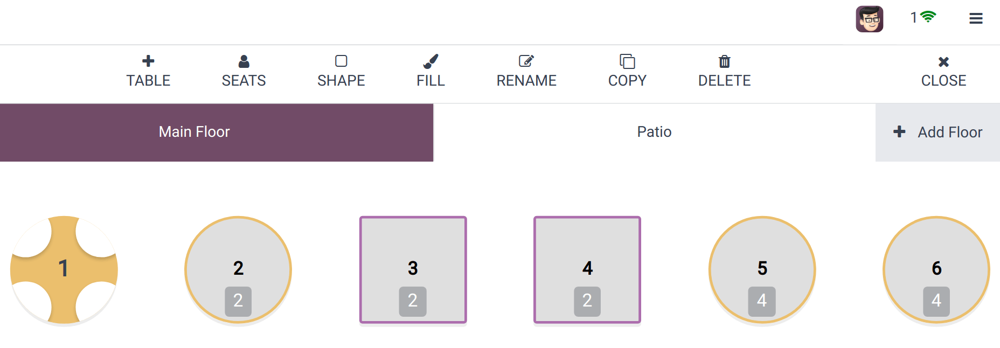
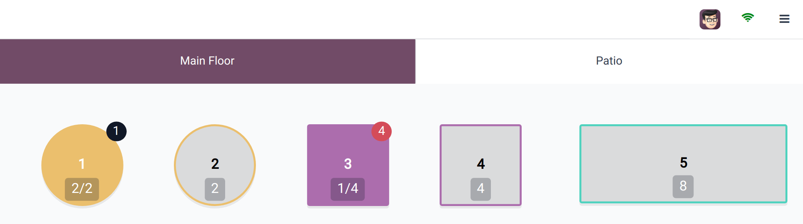

============================
Floors and tables management
============================

Configuration
=============

From the POS settings
---------------------

To create floors and tables from the backend, :ref:`access your POS' settings
<configuration/settings>` and click :guilabel:`→ Floors` under the :guilabel:`Floors & Tables Map`
category of the :guilabel:`Restaurant Mode` section.

Then, click :guilabel:`New` to create a floor, give it a name, select the point of sales where that
floor is to be displayed, and click :guilabel:`Add a line` to add some tables. Doing so opens a
pop-up window to give your table a name, a number of seats, and to link it to an appointment
resource. When satisfied with your table, click :guilabel:`Save & Close` or :guilabel:`Save & New`
or click :guilabel:`Discard` to abort.

.. note::
   - Your POS must be :ref:`configured as a bar or a restaurant <restaurant/configuration>` for that
     section to be displayed.
   - To create a map of your restaurant or bar reflecting your actual floor plan, you must open the
     POS and edit in the frontend.

.. tip::
   Create floors on the spot: click next to Floors and start typing your floor name.Then, press
   "enter" to create it.

From the POS frontend
---------------------

To create floors and tables from the frontend, :ref:`open a POS session <pos/session-start>`,
click the hamburger menu icon :guilabel:`≡` on the upper right corner, and :guilabel:`Edit Plan` to
enter the **edit mode**.

Add a floor by clicking :guilabel:`+ Add Floor`, which opens a pop-up window where you can choose a
name for it.

Once a floor is created, add a table by clicking :guilabel:`+ TABLE`. You can move it by selecting
it and drag and dropping it as desired. Once a table is selected, you can also change the number of
seats available by clicking :guilabel:`SEATS`, the table shape by clicking :guilabel:`SHAPE`, the
table color by clicking :guilabel:`FILL`, or the table name by clicking :guilabel:`RENAME`. To
duplicate an existing table, click :guilabel:`COPY`. You can also remove a table by clicking
:guilabel:`DELETE`.

Click :guilabel:`CLOSE` once you are satisfied with your floor plan to save it.

.. note::
   If no table is selected, the modification are applied to the floor background.

.. warning::
   Removing a table or a floor cannot be undone.

Floor plan key
==============

Here are the keys to understanding what your floor plan view is telling you:

- Table 1: an order is placed and has been sent to the kitchen.
- Table 3: an order of four items is placed and needs to be sent to the kitchen.
- Tables 2, 4, and 5: the tables are available.
- Tables 2, 4, and 5: the total capacity of these tables is respectively 2, 4, and 8 people.
- Table 3: the table is taken by one person, out of a total capacity of 4.

.. _floors_tables/orders:

Take orders
===========

Click a table to access the POS interface and start taking your customer's order. The system
automatically associates the order to the chosen table, allowing you to add more items and generate
a bill specifically tied to the orders placed at that table.

Once an order is placed, go back to the floor plan view by clicking :guilabel:`BACK` and select
another table to register another order.

.. note::
   As soon as you click a table, the number of guests is automatically set to one guest. If you
   select a table by mistake, click :guilabel:`Release table` to free the selected table, or
   :ref:`transfer the customer <floors_tables/transfer>` to another table.

.. _floors_tables/transfer:

Table transfer
==============

To transfer customers from one table to another, click :guilabel:`→ Transfer` on the POS interface.
Then, select the new table. Doing so transfers the customers and all the orders placed by them and
tied to the previous table.
